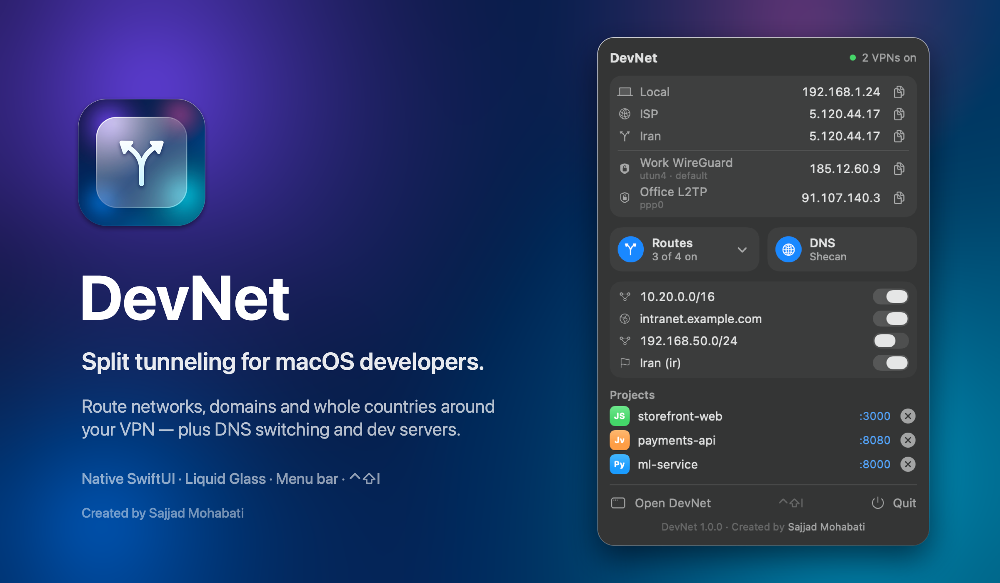

<div align="center">


# DevNet — Split Tunneling & VPN Bypass for macOS

**Route networks, domains and entire countries around your VPN — from the menu bar.**<br>
Plus one-click DNS switching (Shecan, Electro, 403, Cloudflare…) and a dev-server manager.<br>
Native SwiftUI · Liquid Glass · macOS 26 Tahoe · Apple silicon & Intel · Free & open source

[](https://github.com/SajjadMohabati/DevNet/releases/latest/download/DevNet.dmg)
[](#requirements)
[](LICENSE)
[](https://github.com/SajjadMohabati/DevNet/stargazers)

**English** · [فارسی](README.fa.md) · [العربية](README.ar.md)



</div>

---

## Why DevNet?

You're on a VPN. Your company's intranet, your university portal, your bank, a local staging server or every site in
your own country **refuse to work through it** — 403s, timeouts, captchas, slow everything. Your VPN client either has
no split tunneling on macOS, or only "per app", or one hard-coded list you can't edit.

So you end up pasting `sudo route add …` into Terminal, getting `File exists`, losing it all on the next Wi-Fi change,
and never really knowing which IP a site sees.

**DevNet fixes that in one click.** It's a tiny native menu bar app that keeps a set of routes on your LAN gateway —
outside every VPN — and keeps them correct as your networks and VPNs come and go.

## Features

### 🔀 Split tunneling that works with *any* VPN
- **Networks** (`10.20.0.0/16`), **single hosts**, **domains** (`intranet.example.com`, or a full URL — DevNet resolves it)
  and **whole countries** (e.g. every Iranian IP range, ~1,700 CIDRs, from ipdeny.com) bypass the VPN.
- Works alongside **WireGuard, OpenVPN, L2TP/IPsec, IKEv2, ProtonVPN…** — DevNet edits the system routing table, so it
  doesn't care which client you use, or how many are connected.
- **Self-healing:** every route stores what you *want*; DevNet reconciles the live table to it. Rapid clicks, network
  changes and partial failures all converge — no more `File exists` or half-applied lists.
- **Follows your network:** the LAN gateway is auto-detected and re-checked every 10 s. Switch from home Wi-Fi to the
  office and your routes move to the new router automatically.
- Cleans up stale cached host routes that would otherwise keep leaking traffic into the tunnel.

### 🌐 See every IP at a glance — even with several VPNs at once
- **Local IP**, your real **ISP IP** (bypassing all tunnels), the IP **your routed sites see**, and **one line per
  connected VPN** with its own public IP and interface (`utun4 · default`, `ppp0`…).
- Copy any of them with one click.

### 🧭 DNS switching that actually takes effect under a VPN
- Presets for **Shecan, Electro, Begzar, 403, Radar Game, Google, Cloudflare** — add your own.
- Most DNS changers set Wi-Fi DNS and silently lose to the DNS your VPN pushes. DevNet's small root helper overrides it
  **live on every active service, VPNs included**, and restores the originals when you go back to Automatic.
- Shows the resolver macOS is *really* using, latency test for each preset, one-click cache flush.

### 🛠 Dev-server manager
- Lists everything listening on a port, grouped by **project folder** (Node, Bun, Deno, Python, Java/Gradle, Go, Ruby,
  PHP, .NET, Postgres, Redis, nginx…) plus **Docker containers**.
- Open in VS Code, Cursor, IntelliJ, Finder or the browser; **stop** with one click — including LaunchAgent-managed processes that come
  back when you `kill` them.

### ✨ Feels like part of macOS
- Native **SwiftUI**, Control Center–style panel with **Liquid Glass**, light & dark mode.
- Global hotkey (**⌃⇧I** by default, change it in the window sidebar) opens the panel from anywhere, even when the menu bar icon is hidden behind the notch.
- **Passwordless mode:** one prompt installs a sudoers rule limited to exactly `route add/delete`, DNS settings and cache
  flush. Nothing else gets root.
- ~2 MB universal binary, no Electron, no background daemons, no telemetry, no account. Launch at login.

## DevNet vs. the usual options

| | Shell scripts with `route` | VPN client split tunneling | DNS changer apps | **DevNet** |
|---|:-:|:-:|:-:|:-:|
| Works with any VPN, several at once | ⚠️ manual | ❌ its own tunnel only | — | ✅ |
| Route by domain / URL | ❌ | rarely | — | ✅ |
| Route a whole country in one click | ❌ | rarely | — | ✅ |
| Follows Wi-Fi / network changes | ❌ | ✅ | — | ✅ auto-reconcile |
| Shows ISP, routed and per-VPN public IPs | ❌ | ❌ | ❌ | ✅ |
| DNS change wins over VPN-pushed DNS | — | — | ❌ | ✅ |
| Dev-server & Docker manager | ❌ | ❌ | ❌ | ✅ |
| No password prompts, least privilege | ❌ | ✅ | ⚠️ | ✅ scoped sudoers |
| Native, tiny, open source, free | ✅ | varies | varies | ✅ |

## Install

1. **[Download DevNet.dmg](https://github.com/SajjadMohabati/DevNet/releases/latest/download/DevNet.dmg)**, open it and
   drag **DevNet** into **Applications**.
2. Open DevNet. It's open source and ad-hoc signed (not notarized), so the first time macOS asks: go to
   **System Settings › Privacy & Security** and click **Open Anyway** — or run:
   ```bash
   xattr -dr com.apple.quarantine /Applications/DevNet.app
   ```
3. Click the menu bar icon (or press **⌃⇧I**). In the DevNet window, click **Enable Passwordless Mode** once.

### Build from source

```bash
git clone https://github.com/SajjadMohabati/DevNet.git
cd DevNet
./build.sh             # universal build, installs to /Applications
sudo ./install.sh      # optional: passwordless mode + DNS helper (same as the in-app button)
./release.sh           # optional: build the styled DMG
```

Needs only the **Xcode Command Line Tools** — no Xcode project, no dependencies.

## Requirements

macOS 26 Tahoe or later · Apple silicon or Intel

## How it works

| Piece | What it does |
|---|---|
| `route(8)` | Adds `-net`/`-host` routes via your LAN gateway; DevNet diffs wanted vs. live and applies only the difference. |
| `scutil --nc`, `netstat` | Finds connected VPNs, their interfaces and the default route. |
| `curl --interface` | Asks for the public IP through each interface separately. |
| `devnet-dns` helper | Writes `ServerAddresses` into each service's DNS state (backing up the original) via `scutil`. |
| `/etc/sudoers.d/devnet` | Lets your user run *only* the commands above without a password. Remove with `sudo ./install.sh --uninstall`. |

Your data lives in `~/Library/Application Support/VPNRoutes/` as plain JSON.

## FAQ

**Is this a VPN?** No. DevNet decides which traffic *skips* your VPN. Use it with the VPN you already have.

**Will it leak my traffic?** Only destinations you add go around the VPN; everything else stays in the tunnel.

**Can I route all Iranian (or any country's) sites outside the VPN?** Yes — *Add › Country IP Ranges…* and enter `ir`
(or any ISO code). That's how sites that block foreign IPs (403) keep working while you're connected.

**What does passwordless mode change?** It installs one sudoers file allowing `route add/delete`, `networksetup
-setdnsservers`, DNS cache flush and DevNet's DNS helper. Run `sudo ./install.sh --uninstall` to remove it.

## Contributing

Issues and pull requests are welcome. If DevNet saves you time, **⭐ star the repo** — it helps others find it.

## Author

Created by **[Sajjad Mohabati](https://github.com/SajjadMohabati)** · [github.com/SajjadMohabati/DevNet](https://github.com/SajjadMohabati/DevNet)

Released under the [MIT License](LICENSE).

<sub>Keywords: macOS split tunneling, VPN bypass, exclude IP from VPN, route domain outside VPN, static route manager,
Iran IP ranges, Shecan DNS, DNS changer for Mac, WireGuard split tunnel, L2TP split tunnel, menu bar network tool,
developer tools, kill port, local dev server manager.</sub>
